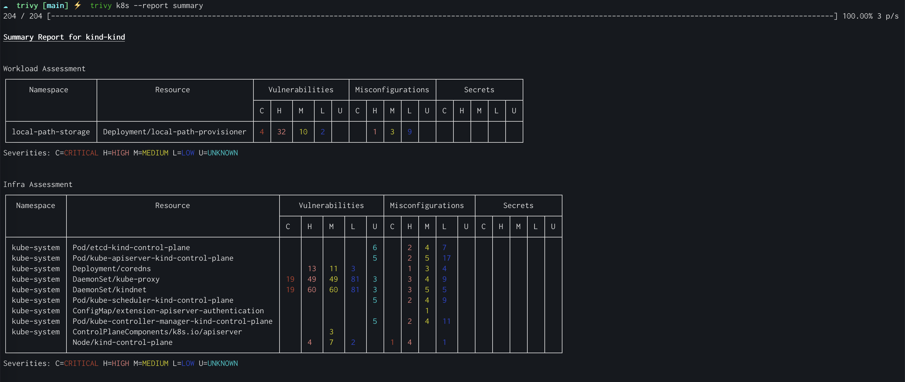

# First steps with Tunnel

## Get Tunnel

Tunnel is available in most common distribution channels. The complete list of installation options is available in the [Installation](./installation.md) page. Here are a few popular examples:

- macOS: `brew install tunnel`
- Docker: `docker run khulnasoft/tunnel`
- Download binary from [GitHub Release](https://github.com/khulnasoft/tunnel/releases/latest/)
- See [Installation](./installation.md) for more

Tunnel is integrated with many popular platforms and applications. The complete list of integrations is available in the [Ecosystem](../ecosystem/index.md) page. Here are a few popular options examples:

- [GitHub Actions](https://github.com/aquasecurity/tunnel-action)
- [Kubernetes operator](https://github.com/aquasecurity/tunnel-operator)
- [VS Code plugin](https://github.com/aquasecurity/tunnel-vscode-extension)
- See [Ecosystem](../ecosystem/index.md) for more

## General usage

Tunnel's Command Line Interface pattern follows its major concepts: targets (what you want to scan), and scanners (what you want to scan for):

```bash
tunnel <target> [--scanners <scanner1,scanner2>] <subject>
```

### Examples

Scan a container image from registry, with the default scanner which is Vulnerabilities scanner:

```bash
tunnel image python:3.4-alpine
```

<video width="1000" muted controls>
  <source src="https://user-images.githubusercontent.com/1161307/171013513-95f18734-233d-45d3-aaf5-d6aec687db0e.mov" type="video/mp4" />
</video>

Scan a local code repository, for vulnerabilities, exposed secrets and misconfigurations:

```bash
tunnel fs --scanners vuln,secret,misconfig /path/to/myproject
```

<video width="1000" muted controls>
  <source src="https://user-images.githubusercontent.com/1161307/171013917-b1f37810-f434-465c-b01a-22de036bd9b3.mov" type="video/mp4" />
</video>

Scan a Kubernetes cluster, with all available scanners, and show a summary report:

```bash
tunnel k8s --report summary cluster
```



For a more complete introduction, check out the basic Tunnel Demo: <https://github.com/itaysk/tunnel-demo>

## Learn more

Now that you up and ready, here are some resources to help you deepen your knowledge:

- Learn more about Tunnel's capabilities by exploring the complete [documentation](../docs/index.md).
- Explore community questions and under [GitHub Discussions](https://github.com/khulnasoft/tunnel/discussions).
- Stay up to date by watching for [New Releases & Announcements](https://github.com/khulnasoft/tunnel/discussions/categories/announcements).
- Follow Tunnel on Twitter/X: [@aquatunnel](https://x.com/aquatunnel)
- Explore and subscribe to our YouTube channel [@AquaSecOSS](http://youtube.com/@aquasecoss)

# Want more? Check out Aqua

If you liked Tunnel, you will love Aqua which builds on top of Tunnel to provide even more enhanced capabilities for a complete security management offering.  
You can find a high level comparison table specific to Tunnel users [here](../commercial/compare.md).  
In addition, check out the <https://khulnasoft.com> website for more information about our products and services.
If you'd like to contact Aqua or request a demo, please use this form: <https://www.khulnasoft.com/demo>
