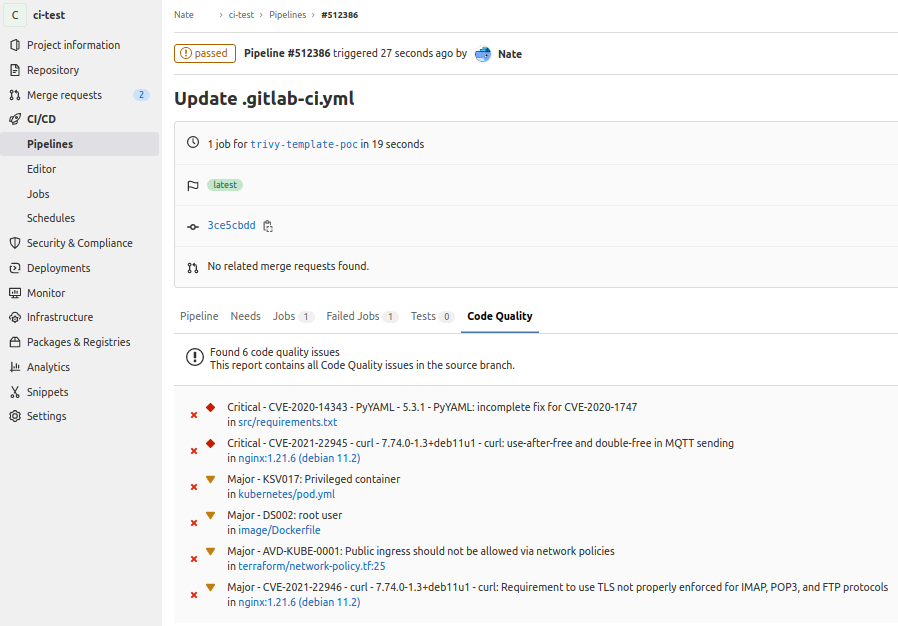

# GitLab CI

GitLab 15.0 includes [free](https://gitlab.com/groups/gitlab-org/-/epics/2233) integration with Tunnel.

To [configure container scanning with Tunnel in GitLab](https://docs.gitlab.com/ee/user/application_security/container_scanning/#configuration), simply include the CI template in your `.gitlab-ci.yml` file:

```yaml
include:
  - template: Security/Container-Scanning.gitlab-ci.yml
```

If you're a GitLab 14.x Ultimate customer, you can use the same configuration above.

Alternatively, you can always use the example configurations below.

```yaml
stages:
  - test

tunnel:
  stage: test
  image: docker:stable
  services:
    - name: docker:dind
      entrypoint: ["env", "-u", "DOCKER_HOST"]
      command: ["dockerd-entrypoint.sh"]
  variables:
    DOCKER_HOST: tcp://docker:2375/
    DOCKER_DRIVER: overlay2
    # See https://github.com/docker-library/docker/pull/166
    DOCKER_TLS_CERTDIR: ""
    IMAGE: tunnel-ci-test:$CI_COMMIT_SHA
    TUNNEL_NO_PROGRESS: "true"
    TUNNEL_CACHE_DIR: ".tunnelcache/"
  before_script:
    - export TUNNEL_VERSION=$(wget -qO - "https://api.github.com/repos/khulnasoft/tunnel/releases/latest" | grep '"tag_name":' | sed -E 's/.*"v([^"]+)".*/\1/')
    - echo $TUNNEL_VERSION
    - wget --no-verbose https://github.com/khulnasoft/tunnel/releases/download/v${TUNNEL_VERSION}/tunnel_${TUNNEL_VERSION}_Linux-64bit.tar.gz -O - | tar -zxvf -
  allow_failure: true
  script:
    # Build image
    - docker build -t $IMAGE .
    # Build report
    - ./tunnel image --exit-code 0 --format template --template "@/contrib/gitlab.tpl" -o gl-container-scanning-report.json $IMAGE
    # Print report
    - ./tunnel image --exit-code 0 --severity HIGH $IMAGE
    # Fail on severe vulnerabilities
    - ./tunnel image --exit-code 1 --severity CRITICAL $IMAGE
  cache:
    paths:
      - .tunnelcache/
  # Enables https://docs.gitlab.com/ee/user/application_security/container_scanning/ (Container Scanning report is available on GitLab Ultimate)
  artifacts:
    reports:
      container_scanning: gl-container-scanning-report.json
```

[Example][example]
[Repository][repository]

### GitLab CI using Tunnel container

To scan a previously built image that has already been pushed into the
GitLab container registry the following CI job manifest can be used.
Note that `entrypoint` needs to be unset for the `script` section to work.
In case of a non-public GitLab project Tunnel additionally needs to
authenticate to the registry to be able to pull your application image.
Finally, it is not necessary to clone the project repo as we only work
with the container image.

```yaml
container_scanning:
  image:
    name: docker.io/khulnasoft/tunnel:latest
    entrypoint: [""]
  variables:
    # No need to clone the repo, we exclusively work on artifacts. See
    # https://docs.gitlab.com/ee/ci/runners/configure_runners.html#git-strategy
    GIT_STRATEGY: none
    TUNNEL_USERNAME: "$CI_REGISTRY_USER"
    TUNNEL_PASSWORD: "$CI_REGISTRY_PASSWORD"
    TUNNEL_AUTH_URL: "$CI_REGISTRY"
    TUNNEL_NO_PROGRESS: "true"
    TUNNEL_CACHE_DIR: ".tunnelcache/"
    FULL_IMAGE_NAME: $CI_REGISTRY_IMAGE:$CI_COMMIT_REF_SLUG
  script:
    - tunnel --version
    # update vulnerabilities db
    - time tunnel image --download-db-only
    # Builds report and puts it in the default workdir $CI_PROJECT_DIR, so `artifacts:` can take it from there
    - time tunnel image --exit-code 0 --format template --template "@/contrib/gitlab.tpl"
        --output "$CI_PROJECT_DIR/gl-container-scanning-report.json" "$FULL_IMAGE_NAME"
    # Prints full report
    - time tunnel image --exit-code 0 "$FULL_IMAGE_NAME"
    # Fail on critical vulnerabilities
    - time tunnel image --exit-code 1 --severity CRITICAL "$FULL_IMAGE_NAME"
  cache:
    paths:
      - .tunnelcache/
  # Enables https://docs.gitlab.com/ee/user/application_security/container_scanning/ (Container Scanning report is available on GitLab EE Ultimate or GitLab.com Gold)
  artifacts:
    when:                          always
    reports:
      container_scanning:          gl-container-scanning-report.json
  tags:
    - docker-runner
```

[example]: https://gitlab.com/khulnasoft/tunnel-ci-test/pipelines
[repository]: https://github.com/khulnasoft/tunnel-ci-test

### GitLab CI alternative template

Depending on the edition of gitlab you have or your desired workflow, the
container scanning template may not meet your needs. As an addition to the
above container scanning template, a template for
[code climate](https://docs.gitlab.com/ee/ci/testing/code_quality.html)
has been included. The key things to update from the above examples are
the `template` and `report` type. An updated example is below.

```yaml
stages:
  - test

tunnel:
  stage: test
  image: docker:stable
  services:
    - name: docker:dind
      entrypoint: ["env", "-u", "DOCKER_HOST"]
      command: ["dockerd-entrypoint.sh"]
  variables:
    DOCKER_HOST: tcp://docker:2375/
    DOCKER_DRIVER: overlay2
    # See https://github.com/docker-library/docker/pull/166
    DOCKER_TLS_CERTDIR: ""
    IMAGE: tunnel-ci-test:$CI_COMMIT_SHA
    TUNNEL_NO_PROGRESS: "true"
    TUNNEL_CACHE_DIR: ".tunnelcache/"
  before_script:
    - export TUNNEL_VERSION=$(wget -qO - "https://api.github.com/repos/khulnasoft/tunnel/releases/latest" | grep '"tag_name":' | sed -E 's/.*"v([^"]+)".*/\1/')
    - echo $TUNNEL_VERSION
    - wget --no-verbose https://github.com/khulnasoft/tunnel/releases/download/v${TUNNEL_VERSION}/tunnel_${TUNNEL_VERSION}_Linux-64bit.tar.gz -O - | tar -zxvf -
  allow_failure: true
  script:
    # Build image
    - docker build -t $IMAGE .
    # Image report
    - ./tunnel image --exit-code 0 --format template --template "@/contrib/gitlab-codequality.tpl" -o gl-codeclimate-image.json $IMAGE
    # Filesystem report
    - ./tunnel filesystem --scanners misconfig,vuln --exit-code 0 --format template --template "@/contrib/gitlab-codequality.tpl" -o gl-codeclimate-fs.json .
    # Combine report
    - apk update && apk add jq
    - jq -s 'add' gl-codeclimate-image.json gl-codeclimate-fs.json > gl-codeclimate.json
  cache:
    paths:
      - .tunnelcache/
  # Enables https://docs.gitlab.com/ee/user/application_security/container_scanning/ (Container Scanning report is available on GitLab EE Ultimate or GitLab.com Gold)
  artifacts:
    paths:
      - gl-codeclimate.json
    reports:
      codequality: gl-codeclimate.json
```

Currently gitlab only supports a single code quality report. There is an
open [feature request](https://gitlab.com/gitlab-org/gitlab/-/issues/9014)
to support multiple reports. Until this has been implemented, if you
already have a code quality report in your pipeline, you can use
`jq` to combine reports. Depending on how you name your artifacts, it may
be necessary to rename the artifact if you want to reuse the name. To then
combine the previous artifact with the output of tunnel, the following `jq`
command can be used, `jq -s 'add' prev-codeclimate.json tunnel-codeclimate.json > gl-codeclimate.json`.

### GitLab CI alternative template example report

You'll be able to see a full report in the GitLab pipeline code quality UI, where filesystem vulnerabilities and misconfigurations include links to the flagged files and image vulnerabilities report the image/os or runtime/library that the vulnerability originates from instead.


