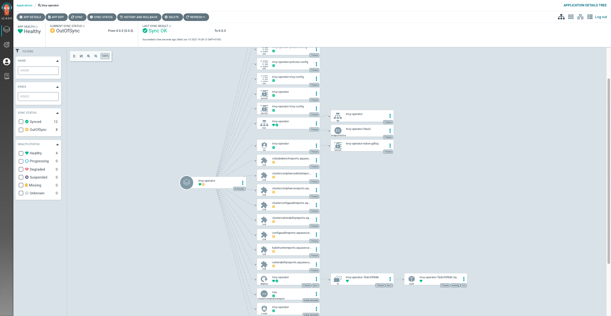

# Installing the Tunnel-Operator through GitOps

This tutorial shows you how to install the Tunnel Operator through GitOps platforms, namely ArgoCD and FluxCD.

## ArgoCD

Make sure to have [ArgoCD installed](https://argo-cd.readthedocs.io/en/stable/getting_started/) and running in your Kubernetes cluster.

You can either deploy the Tunnel Operator through the argocd CLI or by applying a Kubernetes manifest.

ArgoCD command:

```
> kubectl create ns tunnel-system
> argocd app create tunnel-operator --repo https://github.com/aquasecurity/tunnel-operator --path deploy/helm --dest-server https://kubernetes.default.svc --dest-namespace tunnel-system
```

Note that this installation is directly related to our official Helm Chart. If you want to change any of the value, we'd suggest you to create a separate values.yaml file.

Kubernetes manifest `tunnel-operator.yaml`:

```
apiVersion: argoproj.io/v1alpha1
kind: Application
metadata:
  name: tunnel-operator
  namespace: argocd
spec:
  project: default
  source:
    chart: tunnel-operator
    repoURL: https://khulnasoft.github.io/helm-charts/
    targetRevision: 0.0.3
    helm:
      values: |
        tunnel:
          ignoreUnfixed: true
  destination:
    server: https://kubernetes.default.svc
    namespace: tunnel-system
  syncPolicy:
    automated:
      prune: true
      selfHeal: true
```

To apply the Kubernetes manifest, if you have the manifest locally, you can use the following command through kubectl:

```
> kubectl apply -f tunnel-operator.yaml

application.argoproj.io/tunnel-operator created
```

If you have the manifest in a Git repository, you can apply it to your cluster through the following command:

```
> kubectl apply -n argocd -f https://raw.githubusercontent.com/AnaisUrlichs/argocd-starboard/main/starboard/argocd-starboard.yaml
```

The latter command would allow you to make changes to the YAML manifest that ArgoCD would register automatically.

Once deployed, you want to tell ArgoCD to sync the application from the actual state to the desired state:

```
argocd app sync tunnel-operator
```

Now you can see the deployment in the ArgoCD UI. Have a look at the ArgoCD documentation to know how to access the UI.



Note that ArgoCD is unable to show the Tunnel CRDs as synced.

## FluxCD

Make sure to have [FluxCD installed](https://fluxcd.io/docs/installation/#install-the-flux-cli) and running in your Kubernetes cluster.

You can either deploy the Tunnel Operator through the Flux CLI or by applying a Kubernetes manifest.

Flux command:

```
> kubectl create ns tunnel-system
> flux create source helm tunnel-operator --url https://khulnasoft.github.io/helm-charts --namespace tunnel-system
> flux create helmrelease tunnel-operator --chart tunnel-operator
  --source HelmRepository/tunnel-operator
  --chart-version 0.0.3
  --namespace tunnel-system
```

Kubernetes manifest `tunnel-operator.yaml`:

```
apiVersion: source.toolkit.fluxcd.io/v1beta2
kind: HelmRepository
metadata:
  name: tunnel-operator
  namespace: flux-system
spec:
  interval: 60m
  url: https://khulnasoft.github.io/helm-charts/

---
apiVersion: helm.toolkit.fluxcd.io/v2beta1
kind: HelmRelease
metadata:
  name: tunnel-operator
  namespace: tunnel-system
spec:
  chart:
    spec:
      chart: tunnel-operator
      sourceRef:
        kind: HelmRepository
        name: tunnel-operator
        namespace: flux-system
      version: 0.10.1
  interval: 60m
  values:
    tunnel:
      ignoreUnfixed: true
  install:
    crds: CreateReplace
    createNamespace: true
```

You can then apply the file to your Kubernetes cluster:

```
kubectl apply -f tunnel-operator.yaml
```

## After the installation

After the install, you want to check that the Tunnel operator is running in the tunnel-system namespace:

```
kubectl get deployment -n tunnel-system
```
